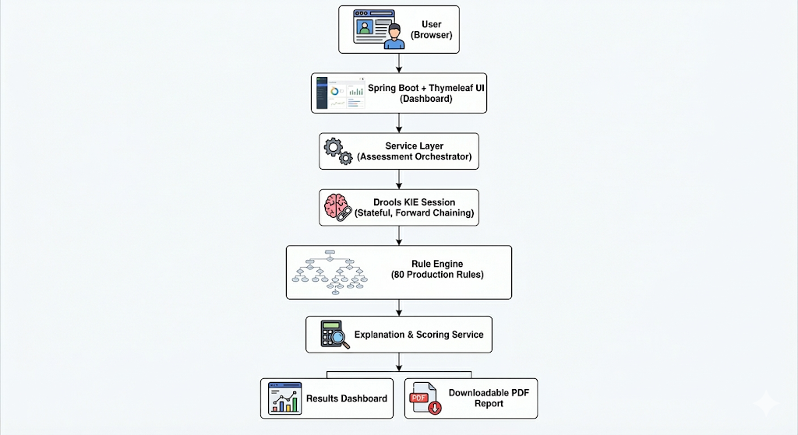

# MSME Loan Readiness & Self-Assessment Tool

## 🔹 Overview

This project is a **rule-based, knowledge-engineered expert system** that enables Micro, Small, and Medium Enterprises (MSMEs) to self-assess their loan readiness before approaching banks.

The system is **not AI/ML-based**. Instead, it codifies domain expertise directly: **120+ Drools production rules** were manually derived from **RBI MSME lending principles, banking credit policies, and standard credit risk assessment practices**.

At its core, the application uses **Drools forward chaining with salience-based conflict resolution**, integrated into a **Spring Boot + Thymeleaf web application** with an interactive dashboard and built-in PDF report generation.

---

## 🎯 Problem Statement

MSMEs often face opaque lending processes and struggle to understand:

* Why applications are rejected or delayed
* Whether their financials meet lender expectations
* What specific areas need improvement
* How banks evaluate risk across multiple dimensions

This tool provides:

* A structured **pre-loan diagnostic**
* Transparent, explainable decision-making
* Identification of risk areas
* Concrete, actionable improvement targets
* A repeatable, standardized assessment workflow

---

## 🏗️ Technical Architecture

### High-Level Architecture



### Technology Stack

| Layer                | Technology                     |
| -------------------- | ------------------------------ |
| Backend              | Java 17                        |
| Web Framework        | Spring Boot                    |
| View Layer           | Thymeleaf                      |
| Rule Engine          | Drools (KIE, Stateful Session) |
| Build Tool           | Maven                          |
| Decision Strategy    | Forward Chaining + Salience    |
| Reporting            | Server-generated PDF           |
| Deployment (Planned) | AWS EC2 + WAF                  |

---

## 🧠 Drools Rule Architecture (14 Sections)

The rule base is organized into **14 logical sections**, each with a clear responsibility:

| Section                      | Purpose                                    |
| ---------------------------- | ------------------------------------------ |
| 1. Data Completeness Rules   | Validate mandatory inputs before reasoning |
| 2. Basic Eligibility Rules   | MSME classification & legal status checks  |
| 3. Financial Integrity Rules | Accounting consistency validation          |
| 4. Liquidity Risk Rules      | Current Ratio, Working Capital adequacy    |
| 5. Solvency Risk Rules       | Debt-to-Equity (D/E) evaluation            |
| 6. Profitability Rules       | Net Profit Margin (NPM), ROE assessment    |
| 7. Cash Flow Rules           | DSCR computation and thresholds            |
| 8. Leverage Rules            | Borrowing limits and risk flags            |
| 9. Compliance Rules          | Regulatory & documentation checks          |
| 10. Credit Behavior Rules    | Defaults, delays, and payment history      |
| 11. Sector Risk Rules        | Industry-specific risk signals             |
| 12. Operational Risk Rules   | Business stability indicators              |
| 13. Aggregation Rules        | Multi-dimensional risk scoring             |
| 14. Decision Rules           | Final classification                       |

### Forward Chaining & Salience Design

* The system uses **forward chaining**:

    * Input facts → trigger rules
    * Rules assert new derived facts → trigger further reasoning
* **Salience controls execution priority**:

    * **High salience:** data validation & eligibility
    * **Medium salience:** financial ratio evaluation
    * **Low salience:** risk aggregation
    * **Lowest salience:** final decision rules

This ensures **deterministic, transparent, and auditable reasoning**, which is critical for financial decision support.

---

## 📊 Multi-Dimensional Risk Scoring Model

The system computes a composite risk profile across multiple dimensions:

| Dimension     | Key Metrics Used                       |
| ------------- | -------------------------------------- |
| Liquidity     | **Current Ratio**                      |
| Solvency      | **Debt-to-Equity (D/E)**               |
| Cash Flow     | **DSCR (Debt Service Coverage Ratio)** |
| Profitability | **Net Profit Margin (NPM), ROE**       |
| Compliance    | Documentation & statutory adherence    |
| Operational   | Business stability indicators          |
| Sectoral      | Industry-specific risk factors         |

Each dimension contributes to an overall **Risk Score (0–100)**, which feeds into the final decision.

---

## ✅ Decision Logic

The engine produces one of four outcomes:

| Decision                | Interpretation                              |
| ----------------------- | ------------------------------------------- |
| **APPROVE**             | Strong financials, low risk, compliant      |
| **CONDITIONAL_APPROVE** | Generally acceptable but needs improvements |
| **REJECT**              | High financial or compliance risk           |
| **REFER**               | Ambiguous case requiring human review       |

---

## 🔍 Explainability & Reasoning (Key Differentiator)

Unlike black-box systems, this tool is fully explainable:

For every assessment, the system provides:

1. **List of Fired Drools Rules**
2. **Identified Risk Areas**, e.g.:

    * “DSCR below recommended threshold”
    * “High leverage risk (D/E > 2.0)”
    * “Weak profitability trend”
3. **Concrete Improvement Targets**, such as:

    * “Improve Current Ratio to ≥ 1.5”
    * “Reduce Debt-to-Equity below 2.0”
    * “Increase DSCR above 1.25”
4. **Traceable Decision Path**, showing how intermediate conclusions led to the final outcome.

This makes the system suitable for **audit, compliance, and credit training use cases**.

---

## 🖥️ User Interface (Thymeleaf Dashboard)

The application includes a web-based dashboard that provides:

* Guided data input for MSMEs
* Real-time validation feedback
* Visual risk summary across dimensions
* Clear decision display (APPROVE/CONDITIONAL/REJECT/REFER)
* Actionable recommendations panel

### PDF Report Generation

Users can download a structured PDF report containing:

* Business profile summary
* Computed financial ratios
* Risk scores across dimensions
* Fired rules summary
* Identified gaps & improvement plan
* Final decision classification

This makes the tool suitable for sharing with accountants, consultants, or lenders.

---


## ⚙️ Installation & Setup

### Prerequisites

* Java 17
* Maven 3.8+
* Git

### Build & Run Locally

```sh
git clone https://github.com/your-repo/msme-loan-assessment.git
cd msme-loan-assessment
mvn clean install
mvn spring-boot:run
```

Access the application at:

```
http://localhost:8080
```


---

## 🧪 Testing

* Unit tests for:

    * Financial ratio calculations (DSCR, D/E, Current Ratio, ROE, NPM)
* Drools Rule Unit tests for:

    * Critical decision paths
    * Boundary conditions (threshold edges)
* Integration tests:

    * End-to-end assessment workflow
    * PDF generation validation

Run tests:

```sh
mvn test
```

---

## 📌 Use Cases

* MSME self-assessment before bank application
* Financial consultants performing readiness checks
* Banks simulating preliminary screening
* Training tool for junior credit analysts
* Compliance & audit demonstration

---

## 🔐 Compliance & Security

* No mandatory collection of highly sensitive personal data
* Input validation before rule execution
* Explainability logs maintained for traceability
* Decision logic aligned with **RBI MSME lending principles**
* Deterministic, auditable reasoning (no black-box AI)
* Planned protection via **AWS WAF** in production

---

## 🚀 Future Enhancements

* Enhanced analytics on the dashboard
* “What-if” scenario simulation (e.g., impact of improving DSCR)
* Sector-specific rule modules
* Configurable thresholds via external rule repository
* Integration with accounting tools (Tally, Zoho Books)
* Role-based access for consultants and advisors

